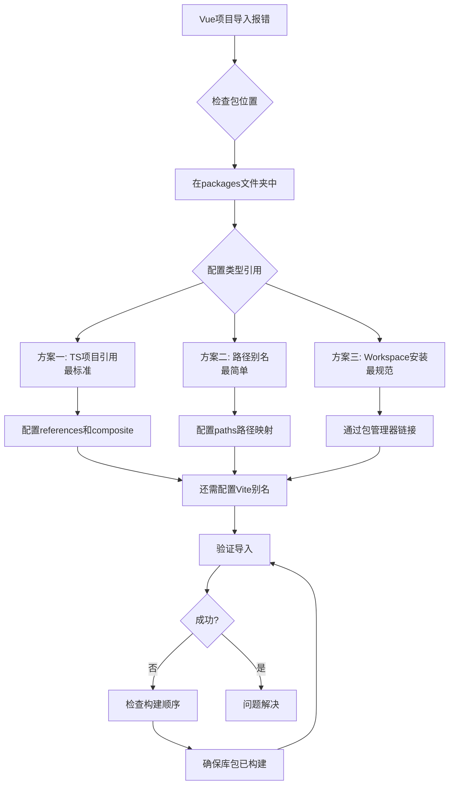

在 monorepo 中引用本地包的类型问题，需要建立**项目间的类型引用关系**。以下是针对不同 monorepo 工具（pnpm/yarn/npm workspaces）的完整解决方案。


## 方案一：配置 TypeScript 项目引用（推荐）
❌

这是最标准的 TypeScript monorepo 解决方案。

### 1. 项目结构示例
```
monorepo/
├── packages/
│   ├── foo/                    # @three/foo 包
│   │   ├── src/
│   │   │   ├── index.ts
│   │   │   └── types.ts
│   │   ├── package.json
│   │   └── tsconfig.json
│   └── bar/
├── apps/
│   └── vue-app/                # 你的 Vue 项目
│       ├── src/
│       ├── package.json
│       └── tsconfig.json
├── tsconfig.base.json          # 共享基础配置
└── package.json
```

### 2. 配置步骤

**步骤 1：配置基础共享配置**
```json
// tsconfig.base.json（根目录）
{
  "compilerOptions": {
    "target": "ES2020",
    "module": "ESNext",
    "lib": ["ES2020", "DOM", "DOM.Iterable"],
    "strict": true,
    "esModuleInterop": true,
    "skipLibCheck": true,
    "moduleResolution": "bundler",
    "allowImportingTsExtensions": true,
    "resolveJsonModule": true,
    "isolatedModules": true,
    "noEmit": true,
    "baseUrl": ".",
    "paths": {
      "@three/*": ["packages/*/src"]
    }
  }
}
```

**步骤 2：配置库包（@three/foo）**
```json
// packages/foo/tsconfig.json
{
  "extends": "../../tsconfig.base.json",
  "compilerOptions": {
    "composite": true,           // 关键：允许被引用
    "declaration": true,         // 关键：生成 .d.ts 文件
    "declarationMap": true,      // 可选：用于调试
    "outDir": "./dist",
    "rootDir": "./src"
  },
  "include": ["src/**/*"],
  "exclude": ["node_modules", "dist"]
}
```

**步骤 3：配置 Vue 项目**
```json
// apps/vue-app/tsconfig.json
{
  "extends": "../../tsconfig.base.json",
  "compilerOptions": {
    "jsx": "preserve",
    "module": "ESNext",
    "moduleResolution": "bundler",
    "types": ["vue", "vite/client"],
    "outDir": "./dist",
    "rootDir": "./src"
  },
  "references": [  // 关键：引用本地包
    { "path": "../../packages/foo" }
  ],
  "include": [
    "src/**/*.ts",
    "src/**/*.d.ts",
    "src/**/*.tsx",
    "src/**/*.vue"
  ]
}
```

**步骤 4：配置 Vite**
```typescript
// apps/vue-app/vite.config.ts
import { defineConfig } from 'vite';
import vue from '@vitejs/plugin-vue';
import { resolve } from 'path';

export default defineConfig({
  plugins: [vue()],
  resolve: {
    alias: {
      // 关键：让 Vite 能找到本地包
      '@three/foo': resolve(__dirname, '../../packages/foo/src'),
    }
  },
  server: {
    fs: {
      // 允许访问 monorepo 根目录
      allow: ['../..']
    }
  }
});
```

**步骤 5：使用构建命令**
```bash
# 使用 TypeScript 的构建模式（识别 references）
cd apps/vue-app
tsc --build  # 或 tsc -b
```

## 方案二：路径别名直接引用源码（简单直接）
❌
适用于不想使用项目引用的小型项目。

### 1. 只配置 tsconfig.json
```json
// apps/vue-app/tsconfig.json
{
  "compilerOptions": {
    "target": "ES2020",
    "baseUrl": ".",
    "paths": {
      "@three/foo": ["../../packages/foo/src"],
      "@three/foo/*": ["../../packages/foo/src/*"]
    }
  }
}
```

### 2. 在代码中直接引用
```typescript
// 现在可以正常导入，TypeScript 会找到源码
import { fa } from '@three/foo';
```

### 3. Vite 配置对应别名
```typescript
// vite.config.ts
export default defineConfig({
  resolve: {
    alias: {
      '@three/foo': resolve(__dirname, '../../packages/foo/src'),
    }
  }
});
```

## 方案三：使用 monorepo 工具的 workspace 特性
❌
### 对于 pnpm workspace：

**根目录 package.json**
```json
{
  "private": true,
  "scripts": {
    "dev": "pnpm -r --filter=./apps/vue-app dev",
    "build": "pnpm -r build"
  }
}
```

**包之间正确安装**
```bash
# 在 vue-app 中安装本地包
pnpm add @three/foo --filter vue-app

# 或者从根目录安装所有依赖
pnpm install
```

### 对于 yarn/npm workspace：

确保 workspaces 配置正确：
```json
// 根目录 package.json
{
  "private": true,
  "workspaces": [
    "packages/*",
    "apps/*"
  ]
}
```

## 方案四：Symlink + 类型生成

### 1. 构建库包生成类型
```json
// packages/foo/package.json
{
  "name": "@three/foo",
  "version": "1.0.0",
  "main": "dist/index.js",
  "types": "dist/index.d.ts",  // 关键：指向类型文件
  "scripts": {
    "build": "tsc --declaration --outDir dist"
  }
}
```

### 2. 构建并链接
```bash
# 1. 构建库包
cd packages/foo
pnpm build  # 生成 dist 文件夹

# 2. 在 Vue 项目中安装
cd apps/vue-app
pnpm add ../../packages/foo
```

### 3. 确保类型文件存在
检查 `packages/foo/dist/index.d.ts` 是否存在：
```typescript
// packages/foo/src/index.ts
export const fa = () => { /* ... */ };
export type FaOptions = { /* ... */ };

// 构建后会生成对应的类型声明
```

## 完整诊断和解决流程



## 常见问题排查

### 问题 1：TypeScript 能找到但 Vite 找不到
**现象**：TS 不报错，但运行时报模块找不到。
**解决**：确保 Vite 配置了相同的别名。

```typescript
// vite.config.ts 确保有这个
alias: {
  '@three/foo': resolve(__dirname, '../../packages/foo/src')
}
```

### 问题 2：循环依赖
**现象**：构建时出现循环依赖错误。
**解决**：重构代码或使用动态导入。

```typescript
// 避免直接导入
const loadFoo = async () => {
  const { fa } = await import('@three/foo');
  // 使用 fa
};
```

### 问题 3：热更新不工作
**现象**：修改库代码，Vue 项目不更新。
**解决**：配置 Vite 的依赖优化。

```typescript
// vite.config.ts
export default defineConfig({
  optimizeDeps: {
    include: ['@three/foo']
  }
});
```

## 最佳实践配置示例

### 完整的 monorepo 配置

**1. 根目录配置**
```json
// package.json
{
  "name": "monorepo",
  "private": true,
  "workspaces": ["packages/*", "apps/*"],
  "scripts": {
    "dev": "turbo run dev --parallel",
    "build": "turbo run build",
    "type-check": "tsc --build --force"
  },
  "devDependencies": {
    "turbo": "latest",
    "typescript": "^5.0.0"
  }
}
```

**2. 库包的完整配置**
```json
// packages/foo/package.json
{
  "name": "@three/foo",
  "version": "1.0.0",
  "main": "dist/index.js",
  "module": "dist/index.esm.js",
  "types": "dist/index.d.ts",
  "exports": {
    ".": {
      "import": "./dist/index.esm.js",
      "require": "./dist/index.js",
      "types": "./dist/index.d.ts"
    }
  },
  "scripts": {
    "build": "tsc && tsc -p tsconfig.esm.json",
    "dev": "tsc --watch"
  }
}
```

**3. Vue 项目的完整配置**
```json
// apps/vue-app/package.json
{
  "name": "vue-app",
  "type": "module",
  "scripts": {
    "dev": "vite",
    "build": "vue-tsc --noEmit && vite build",
    "type-check": "vue-tsc --noEmit"
  },
  "dependencies": {
    "@three/foo": "workspace:*"
  }
}
```

## 快速解决方案（立即生效）

如果你需要立即解决问题，使用这个组合配置：

**步骤 1：tsconfig.json**
```json
{
  "compilerOptions": {
    "baseUrl": ".",
    "paths": {
      "@three/foo": ["../../packages/foo/src/index.ts"],
      "@three/foo/*": ["../../packages/foo/src/*"]
    }
  }
}
```

**步骤 2：vite.config.ts**
```typescript
export default defineConfig({
  resolve: {
    alias: {
      '@three/foo': resolve(__dirname, '../../packages/foo/src')
    }
  }
});
```

**步骤 3：重启开发服务器**
```bash
# 强制重新加载配置
rm -rf node_modules/.vite
npm run dev
```

## 总结

根据你的项目复杂度选择合适的方案：

1. **小型项目**：方案二（路径别名）最简单直接
2. **中型项目**：方案一（TS项目引用）最标准
3. **大型项目**：方案三（workspace）配合 TurboPack 等构建工具
4. **立即解决**：路径别名 + Vite 别名配置

**关键点**：
- 确保 `tsconfig.json` 的 `paths` 配置正确
- 确保 `vite.config.ts` 有对应的 `alias`
- 对于 TS 项目引用，必须设置 `composite: true`
- 使用 `workspace:*` 版本确保链接到本地包

如果还有问题，可以提供你的项目结构，我可以给出更具体的配置建议。