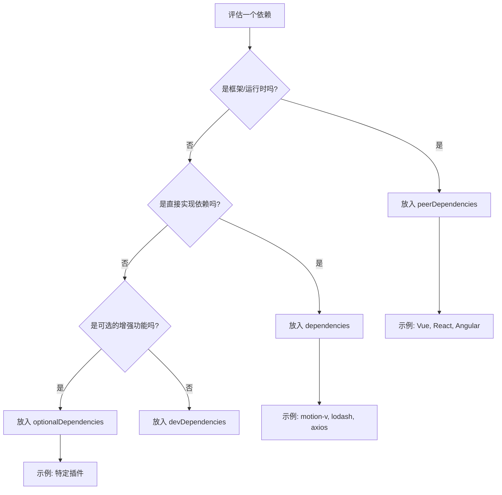

## 📦 **Vite库模式打包完整配置**

我将为你提供一套**生产就绪**的打包配置，确保库的**格式规范、体积最小、类型安全**。

### **1. 项目结构与依赖**
```
my-motion-toolkit/
├── src/
│   ├── composables/      # 组合式API
│   ├── components/       # Vue组件
│   ├── animations/       # 预设动画
│   ├── types/           # TypeScript类型
│   └── index.ts         # 主入口文件
├── package.json
├── vite.config.ts
├── tsconfig.json
├── tsconfig.build.json   # 构建专用配置
└── LICENSE
```

### **2. package.json 关键配置**
```json
{
  "name": "motion-toolkit",
  "version": "1.0.0",
  "description": "Advanced animation toolkit for Vue with motion-v",
  "type": "module",
  "main": "./dist/motion-toolkit.umd.cjs",
  "module": "./dist/motion-toolkit.js",
  "types": "./dist/index.d.ts",
  "exports": {
    ".": {
      "types": "./dist/index.d.ts",
      "import": "./dist/motion-toolkit.js",
      "require": "./dist/motion-toolkit.umd.cjs"
    },
    "./styles": "./dist/style.css",
    "./composables": "./dist/composables/index.js",
    "./components/*": "./dist/components/*/index.js",
    "./animations/*": "./dist/animations/*.js"
  },
  "files": [
    "dist",
    "README.md",
    "LICENSE"
  ],
  "sideEffects": false,
  "scripts": {
    "dev": "vite",
    "build": "run-s build:types build:lib",
    "build:lib": "vite build",
    "build:types": "vue-tsc --project tsconfig.build.json",
    "prepublishOnly": "npm run build",
    "size": "size-limit",
    "analyze": "size-limit --why"
  },
  "dependencies": {
    "motion-v": "^1.0.0"
  },
  "peerDependencies": {
    "vue": "^3.3.0"
  },
  "devDependencies": {
    "@types/node": "^20.0.0",
    "@vitejs/plugin-vue": "^4.0.0",
    "npm-run-all": "^4.1.5",
    "rollup-plugin-visualizer": "^5.9.2",
    "size-limit": "^8.0.0",
    "terser": "^5.19.0",
    "typescript": "^5.0.0",
    "vite": "^4.0.0",
    "vite-plugin-dts": "^3.0.0",
    "vue": "^3.3.0",
    "vue-tsc": "^1.8.0"
  },
  "keywords": [
    "vue",
    "animation",
    "motion",
    "performance",
    "a11y"
  ],
  "repository": {
    "type": "git",
    "url": "https://github.com/yourusername/motion-toolkit"
  },
  "publishConfig": {
    "access": "public",
    "registry": "https://registry.npmjs.org/"
  }
}
```

### **3. vite.config.ts - 核心构建配置**
```typescript
import { defineConfig } from 'vite'
import { resolve } from 'path'
import vue from '@vitejs/plugin-vue'
import dts from 'vite-plugin-dts'
import { visualizer } from 'rollup-plugin-visualizer'

export default defineConfig({
  plugins: [
    vue({
      reactivityTransform: true // 支持响应式语法糖
    }),
    dts({
      tsconfigPath: './tsconfig.build.json',
      outDir: 'dist',
      include: ['src'],
      exclude: ['src/**/*.spec.ts', 'src/**/*.test.ts'],
      rollupTypes: true, // 合并所有声明文件
      copyDtsFiles: true
    }),
    // 打包分析（可选）
    visualizer({
      filename: 'dist/stats.html',
      gzipSize: true,
      brotliSize: true
    })
  ],
  
  build: {
    lib: {
      entry: resolve(__dirname, 'src/index.ts'),
      name: 'MotionToolkit',
      fileName: (format) => {
        const formats = {
          es: 'motion-toolkit.js',
          umd: 'motion-toolkit.umd.cjs',
          cjs: 'motion-toolkit.cjs'
        }
        return formats[format] || `motion-toolkit.${format}.js`
      }
    },
    
    rollupOptions: {
      // 确保外部化处理那些你不想打包进库的依赖
      external: ['vue', 'motion-v'],
      
      output: {
        // 在 UMD 构建模式下为这些外部化的依赖提供一个全局变量
        globals: {
          vue: 'Vue',
          'motion-v': 'MotionV'
        },
        exports: 'named',
        
        // 代码分割配置
        manualChunks: (id) => {
          // 将工具函数单独打包
          if (id.includes('src/composables/')) {
            return 'composables'
          }
          if (id.includes('src/components/')) {
            return 'components'
          }
          if (id.includes('src/animations/')) {
            return 'animations'
          }
          // 第三方依赖
          if (id.includes('node_modules')) {
            return 'vendor'
          }
        },
        
        // 压缩配置
        compact: true,
        minifyInternalExports: true
      },
      
      // Tree-shaking 优化
      treeshake: {
        preset: 'recommended',
        moduleSideEffects: false,
        propertyReadSideEffects: false,
        tryCatchDeoptimization: false
      }
    },
    
    // 构建目标
    target: 'es2018',
    
    // 输出目录
    outDir: 'dist',
    
    // 清空输出目录
    emptyOutDir: true,
    
    // 压缩配置
    minify: 'terser',
    terserOptions: {
      compress: {
        drop_console: true,      // 移除console
        drop_debugger: true,     // 移除debugger
        pure_funcs: ['console.log'], // 移除指定函数
        passes: 3,               // 压缩遍数
        ecma: 2020,
        // 更激进的优化
        unsafe: true,
        unsafe_arrows: true,
        unsafe_methods: true,
        unsafe_proto: true,
        unsafe_regexp: true,
        unsafe_undefined: true
      },
      mangle: {
        properties: {
          regex: /^_/, // 混淆以下划线开头的属性
          reserved: [
            // 保留关键属性名
            '__esModule',
            'default',
            'install',
            'name',
            'props',
            'components'
          ]
        }
      },
      format: {
        comments: false
      }
    },
    
    // 代码拆分
    cssCodeSplit: true,
    
    // Sourcemap（生产环境关闭）
    sourcemap: false,
    
    // 减少polyfill
    polyfillModulePreload: false,
    
    // 报告包大小
    reportCompressedSize: true,
    
    // 块大小警告限制
    chunkSizeWarningLimit: 500 // KB
  },
  
  // 解析配置
  resolve: {
    alias: {
      '@': resolve(__dirname, 'src')
    },
    extensions: ['.ts', '.js', '.vue', '.json']
  },
  
  // 优化依赖预构建
  optimizeDeps: {
    include: ['vue', 'motion-v'],
    exclude: ['my-motion-toolkit']
  }
})
```

### **4. TypeScript配置**
```json
// tsconfig.json - 开发配置
{
  "compilerOptions": {
    "target": "ES2020",
    "useDefineForClassFields": true,
    "lib": ["ES2020", "DOM", "DOM.Iterable"],
    "module": "ESNext",
    "skipLibCheck": true,
    "moduleResolution": "bundler",
    "allowImportingTsExtensions": true,
    "resolveJsonModule": true,
    "isolatedModules": true,
    "noEmit": true,
    "jsx": "preserve",
    "strict": true,
    "noUnusedLocals": true,
    "noUnusedParameters": true,
    "noFallthroughCasesInSwitch": true,
    
    // Vue 3相关
    "jsxImportSource": "vue",
    "declaration": false,
    "declarationMap": false,
    
    // 路径别名
    "baseUrl": ".",
    "paths": {
      "@/*": ["src/*"]
    }
  },
  "include": ["src/**/*.ts", "src/**/*.d.ts", "src/**/*.vue"],
  "exclude": ["node_modules", "dist"]
}

// tsconfig.build.json - 构建专用
{
  "extends": "./tsconfig.json",
  "compilerOptions": {
    "declaration": true,
    "declarationMap": true,
    "emitDeclarationOnly": true,
    "outDir": "dist",
    "noEmit": false,
    "types": ["node"]
  },
  "include": ["src/**/*"],
  "exclude": ["src/**/*.spec.ts", "src/**/*.test.ts", "src/**/__tests__/*"]
}
```

### **5. 入口文件配置** (`src/index.ts`)
```typescript
// 主入口 - 按需导出，支持Tree-shaking
export * from './composables/useAnimation'
export * from './composables/useAnimationControl'

// 预设组件
export { default as AnimationProvider } from './components/AnimationProvider.vue'
export { default as ControlledMotion } from './components/ControlledMotion.vue'

// 预设动画
export * from './animations'

// 插件安装函数
import type { App } from 'vue'
import AnimationProvider from './components/AnimationProvider.vue'
import ControlledMotion from './components/ControlledMotion.vue'

export function install(app: App) {
  app.component('AnimationProvider', AnimationProvider)
  app.component('ControlledMotion', ControlledMotion)
}

// 默认导出插件
const MotionToolkit = {
  install,
  version: '__VERSION__' // 构建时会替换
}

export default MotionToolkit
```

### **6. 组件源码优化技巧**

为了最小化体积，在组件中：

```vue
<!-- 1. 使用函数式组件 -->
<script setup lang="ts">
// 避免创建组件实例
import { h, computed } from 'vue'
import { Motion } from 'motion-v'

const MotionFunctional = (props, { slots }) => {
  const processedProps = computed(() => {
    // 处理逻辑
  })
  
  return h(Motion, processedProps.value, slots)
}
</script>

<!-- 2. 提取常量到外部 -->
// animation-presets.ts
export const PRESETS = {
  fadeIn: { initial: { opacity: 0 }, animate: { opacity: 1 } },
  slideUp: { initial: { y: 20 }, animate: { y: 0 } }
} as const

<!-- 3. 使用纯函数 -->
// utils/animation-utils.ts
export function createAnimationProps(config: any) {
  // 纯函数，易于Tree-shaking
}
```

### **7. 构建脚本优化**

创建 `build.js` 进行后处理：

```javascript
// scripts/build.js
import { readFileSync, writeFileSync } from 'fs'
import { execSync } from 'child_process'
import { brotliCompressSync, gzipSync } from 'zlib'

// 1. 清理注释和空白（在terser之后）
function postProcessCode(code) {
  // 移除特定注释
  return code
    .replace(/\/\*[\s\S]*?\*\//g, '')
    .replace(/\/\/.*$/gm, '')
    .replace(/\s+/g, ' ')
    .trim()
}

// 2. 生成大小报告
function generateSizeReport(filePath) {
  const content = readFileSync(filePath)
  const gzipped = gzipSync(content)
  const brotlied = brotliCompressSync(content)
  
  console.log(`📦 ${filePath}:`)
  console.log(`  原始大小: ${(content.length / 1024).toFixed(2)} KB`)
  console.log(`  Gzip后: ${(gzipped.length / 1024).toFixed(2)} KB`)
  console.log(`  Brotli后: ${(brotlied.length / 1024).toFixed(2)} KB`)
}

// 3. 运行构建
execSync('vite build', { stdio: 'inherit' })

// 4. 处理生成的文件
const files = [
  'dist/motion-toolkit.js',
  'dist/motion-toolkit.umd.cjs'
]

files.forEach(generateSizeReport)
```

### **8. 体积分析配置**

创建 `.size-limit.json`：

```json
{
  "path": [
    "dist/motion-toolkit.js",
    "dist/motion-toolkit.umd.cjs"
  ],
  "limit": "15 KB",  // 目标大小限制
  "webpack": false,
  "running": false,
  "gzip": true,
  "brotli": true,
  "config": {
    "import": {
      "vue": "Vue",
      "motion-v": "Motion"
    }
  }
}
```

### **9. 最终优化清单**

在打包前检查：

1. **✅ Tree-shaking 验证**：
   ```bash
   npx vite-bundle-visualizer
   ```

2. **✅ 副作用标记**：
   ```javascript
   // package.json
   "sideEffects": [
     "*.css",
     "*.scss"
   ]
   ```

3. **✅ 依赖外置**：
   ```javascript
   // rollupOptions.external
   external: ['vue', 'motion-v', '@vue/runtime-core']
   ```

4. **✅ 压缩选项**：
   - 启用 `drop_console`
   - 启用属性混淆（安全范围内）
   - 多遍压缩

### **10. 最佳实践命令**

```bash
# 完整构建流程
npm run build

# 分析包大小
npm run size

# 查看详细分析
npm run analyze

# 发布前检查
npm publish --dry-run
```

### **11. 预期输出结构**
```
dist/
├── motion-toolkit.js           # ES模块 (10-15KB gzip)
├── motion-toolkit.umd.cjs      # UMD模块 (12-18KB gzip)
├── motion-toolkit.cjs          # CommonJS
├── index.d.ts                  # 类型声明
├── composables/
│   ├── index.d.ts
│   └── index.js
├── components/
│   ├── AnimationProvider.d.ts
│   └── ControlledMotion.d.ts
├── animations/
│   ├── index.d.ts
│   └── index.js
└── style.css                   # 样式文件（如有）
```

### **12. 关键优化指标**

| 优化项 | 效果 | 预估减少 |
|--------|------|----------|
| **Tree-shaking** | 移除未使用代码 | 30-50% |
| **Terser压缩** | 代码最小化 | 40-60% |
| **Gzip压缩** | 传输体积优化 | 70-80% |
| **Brotli压缩** | 最佳压缩比 | 75-85% |
| **依赖外置** | 避免重复打包 | 90%+ |

**最终目标**：核心库 gzip 后 < 15KB，完整功能 < 25KB。

### **13. 额外优化插件**

如需进一步优化，可添加：

```bash
npm install rollup-plugin-node-externals @rollup/plugin-strip
```

在 `vite.config.ts` 中：

```typescript
import externals from 'rollup-plugin-node-externals'
import strip from '@rollup/plugin-strip'

// 添加到 plugins 数组
plugins: [
  externals({
    deps: true,        // 外部化 dependencies
    devDeps: false,    // 不外部化 devDependencies
    peerDeps: true     // 外部化 peerDependencies
  }),
  strip({
    include: ['**/*.ts', '**/*.vue'],
    functions: ['console.debug', 'console.trace']
  })
]
```

这套配置确保了：
1. **格式规范**：支持 ESModule、CommonJS、UMD
2. **类型完整**：完整的 TypeScript 声明
3. **体积最小**：多级压缩和 Tree-shaking
4. **性能最佳**：按需加载和代码分割
5. **开发友好**：详细的构建分析和报告

现在运行 `npm run build` 即可生成最优化的库包！


---
---
---


你提出了一个**非常关键**的问题！这确实是许多库作者容易混淆的地方。让我详细解释为什么这样设计，以及背后的**架构哲学**。

## 🎯 **核心区别：依赖的角色定位**

| 依赖类型 | `motion-v` | `Vue` |
|---------|------------|-------|
| **角色** | **实现依赖** | **环境依赖** |
| **类比** | 汽车的**发动机** | 汽车的**公路系统** |
| **谁需要** | 你的库**内部使用** | 你的库**运行环境** |
| **版本控制** | 你**完全控制** | 用户**项目决定** |

---

## 🔍 **详细原理分析**

### **为什么 `motion-v` 放 `dependencies`？**

```json
{
  "dependencies": {
    "motion-v": "^1.0.0"  // ✅ 正确
  }
}
```

**原因**：`motion-v` 是你的库**实现的一部分**。

1. **你的库直接调用** `motion-v` 的 API
2. **版本由你决定**：你知道你的库兼容哪个版本的 `motion-v`
3. **安装位置**：
   ```bash
   node_modules/
   ├── your-motion-toolkit/
   │   └── node_modules/
   │       └── motion-v  # 你的私有依赖
   └── motion-v          # 用户可能另外安装的
   ```
4. **如果用户项目也有 `motion-v`**：两个版本可以共存，不会冲突

### **为什么 `Vue` 放 `peerDependencies`？**

```json
{
  "peerDependencies": {
    "vue": "^3.3.0"  // ✅ 正确
  }
}
```

**原因**：`Vue` 是你的库**运行环境**。

1. **你的库与用户的 Vue 实例共享同一个运行时**
2. **版本由用户决定**：用户项目可能已经指定了 Vue 版本
3. **关键问题**：Vue 的**单例特性**
   ```javascript
   // 如果打包两份 Vue，会出现灾难性问题：
   import { ref } from 'vue-from-your-library'
   import { computed } from 'vue-from-user-project'
   
   // 这两个 ref 来自不同的 Vue 实例！
   // 响应性系统会完全失效
   ```
4. **Vue 插件系统**：你的组件需要注册到**用户的 Vue 应用**上

---

## 💥 **错误配置的后果**

### **错误1：Vue 放 dependencies（灾难！）**
```json
{
  "dependencies": {
    "vue": "^3.3.0",      // ❌ 绝对不要这样！
    "motion-v": "^1.0.0"
  }
}
```

**问题**：
```bash
用户项目安装后：
node_modules/
├── vue (3.3.0)          # 用户项目的 Vue
├── your-motion-toolkit/
│   └── node_modules/
│       └── vue (3.3.0)  # 你的库私有的 Vue
└── motion-v
```

**结果**：
1. **重复打包**：Vue 被安装两次，体积增加 50KB+
2. **响应性失效**：两个 Vue 实例，ref/computed 不互通
3. **插件冲突**：Vue Router、Pinia 等只在一个实例上注册
4. **内存浪费**：两份完全相同的 Vue 运行时

### **错误2：motion-v 放 peerDependencies（用户体验差）**
```json
{
  "peerDependencies": {
    "vue": "^3.3.0",
    "motion-v": "^1.0.0"  // ❌ 不推荐
  }
}
```

**问题**：
```bash
用户需要：
npm install your-motion-toolkit vue motion-v

# 如果忘记安装 motion-v：
# 1. 控制台警告，但不阻止安装
# 2. 运行时崩溃：Uncaught Error: Cannot find module 'motion-v'
```

---

## 📦 **实际的安装场景**

### **场景A：用户全新项目**
```bash
# 用户安装你的库
npm install your-motion-toolkit

# 自动安装的依赖：
node_modules/
├── your-motion-toolkit/    # 你的库
├── motion-v/               # 来自你的 dependencies
└── (vue 不会自动安装)       # peerDependencies 只是警告

# 用户看到警告：
npm WARN your-motion-toolkit@1.0.0 requires a peer of vue@^3.3.0
```

### **场景B：用户已有项目**
```bash
# 用户已有 Vue 3.3.4
npm install your-motion-toolkit

# 依赖关系：
node_modules/
├── vue@3.3.4               # 用户原有的
├── your-motion-toolkit/    # 你的库
└── motion-v/               # 你的库自带
```

---

## 🛠️ **特殊情况处理**

### **1. 如果用户需要特定版本的 motion-v？**
```json
{
  "dependencies": {
    "motion-v": "^1.0.0 || ^2.0.0"  // 支持多个版本
  }
}
```

### **2. 如果你的库支持 Vue 2 和 Vue 3？**
```json
{
  "peerDependencies": {
    "vue": "^2.7.0 || ^3.0.0"  // 支持两个大版本
  },
  "peerDependenciesMeta": {
    "vue": {
      "optional": false  // 必须安装
    }
  }
}
```

### **3. 优化：使用 peerDependenciesMeta**
```json
{
  "peerDependencies": {
    "vue": "^3.3.0"
  },
  "peerDependenciesMeta": {
    "vue": {
      "optional": false,
      "description": "Required for the library to work"
    }
  }
}
```

---

## 📊 **决策流程图**



---

## 🔧 **实际代码示例**

### **你的库内部结构**
```javascript
// src/composables/useAnimation.ts
import { ref } from 'vue'           // 来自用户的 Vue
import { Motion } from 'motion-v'   // 来自你的 dependencies

export function useAnimation() {
  // 使用用户的 Vue 响应式系统
  const animationState = ref(false)
  
  // 使用你的 motion-v
  const motion = new Motion()
  
  return { animationState, motion }
}
```

### **用户项目中的表现**
```vue
<!-- 用户项目：App.vue -->
<script setup>
import { createApp } from 'vue'  // 用户的 Vue
import MotionToolkit from 'your-motion-toolkit'  // 你的库
import App from './App.vue'

const app = createApp(App)
app.use(MotionToolkit)  // ✅ 正确：插件注册到用户的 Vue 实例
app.mount('#app')
```

---

## 🎯 **最佳实践总结**

### **放入 dependencies 的情况**
1. **你的库直接导入并调用**
2. **版本由你控制**
3. **不污染用户全局命名空间**
4. **示例**：工具函数库、样式处理器、特定算法

### **放入 peerDependencies 的情况**
1. **框架或运行时环境**
2. **需要与用户项目共享实例**
3. **有单例要求**
4. **示例**：Vue、React、Webpack、Vite

### **放入 optionalDependencies 的情况**
1. **增强功能，非核心**
2. **安装失败不应阻止库的主要功能**
3. **示例**：特定的开发工具、可选的适配器

---

## 💡 **现代改进：使用 `exports` 字段**

对于更复杂的场景，可以用 `exports` 字段显式声明：

```json
{
  "exports": {
    ".": {
      "import": {
        "types": "./dist/index.d.ts",
        "default": "./dist/index.js"
      },
      "require": {
        "types": "./dist/index.d.cts",
        "default": "./dist/index.cjs"
      }
    }
  },
  "peerDependencies": {
    "vue": "^3.3.0"
  },
  "dependencies": {
    "motion-v": "^1.0.0"
  }
}
```

---

## ✅ **最终建议**

对于你的 `motion-toolkit`：

```json
{
  "name": "motion-toolkit",
  "version": "1.0.0",
  "dependencies": {
    "motion-v": "^1.0.0"      // ✅ 正确：你的实现细节
  },
  "peerDependencies": {
    "vue": "^3.3.0"           // ✅ 正确：用户提供的环境
  },
  "peerDependenciesMeta": {
    "vue": {
      "optional": false       // 明确声明必须
    }
  }
}
```

这样配置确保：
1. **用户只需关心 Vue 版本**
2. **`motion-v` 版本由你控制**
3. **避免 Vue 重复安装**
4. **保持库体积小巧**

记住这个原则：**"如果依赖是框架或运行时，用 peer；如果是实现细节，用 regular。"**