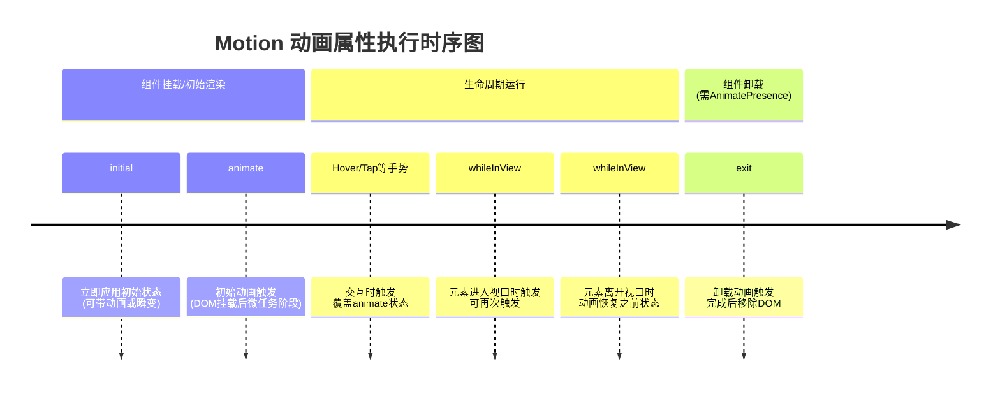
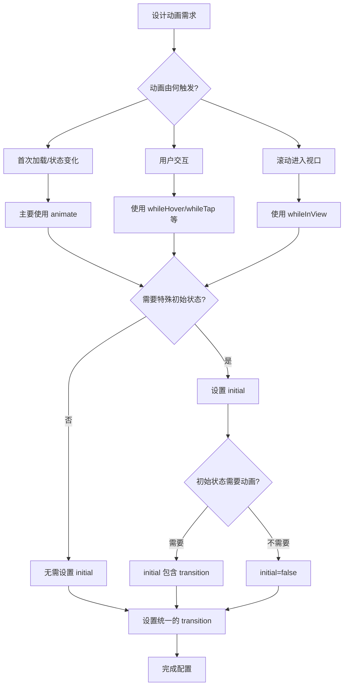
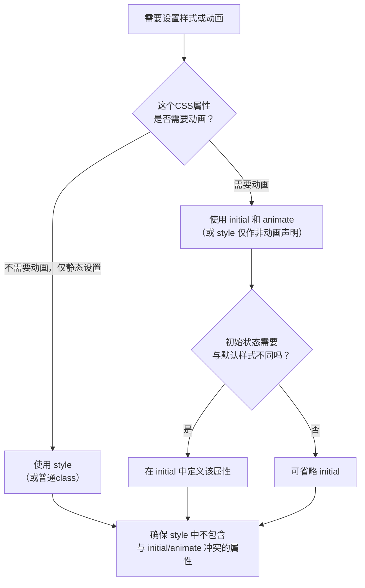

这是一个非常关键的问题。当 Motion 组件同时设置多个动画属性时，它们的触发时机和执行顺序构成了完整的动画生命周期。下图清晰地展示了这一流程：



### 📝 各阶段详细说明

1.  **挂载阶段**
    *   **`initial`**：组件插入DOM后**立即**应用。如果设置了 `transition`，它会从初始状态**动画过渡**到 `animate` 状态；如果 `initial={false}`，则直接跳过，显示 `animate` 状态。
    *   **`animate`**：在 `initial` 应用后，浏览器下一帧（约16ms后）立即开始向 `animate` 定义的状态进行过渡。

2.  **运行阶段**
    *   **手势动画**：如 `whileHover`、`whileTap`。当交互发生时，**立即中断**当前的 `animate` 动画，并过渡到手势定义的状态。交互结束时，**动画返回**到 `animate` 定义的状态。
    *   **视口动画**：`whileInView`。元素进入/离开视口时触发。它的**优先级与 `animate` 相同**，后触发的会覆盖先前的。通常与 `viewport={{ once: true }}` 搭配，保证只触发一次。

3.  **卸载阶段**
    *   **`exit`**：仅在包裹了 `<AnimatePresence>` 且组件条件渲染被移除时触发。`exit` 动画会**完整播放完毕后**，元素才从DOM中移除。

### ⚠️ 关键冲突与覆盖规则

*   **属性冲突**：如果 `animate` 和 `whileInView` 都定义了 `x` 属性，那么先触发 `animate`，后触发 `whileInView` 时，`x` 会**平滑过渡**到 `whileInView` 的目标值。
*   **过渡继承**：`transition` 属性是**可继承和覆盖**的。在根元素设置的 `transition` 会作用于所有动画，但你可以在 `animate`、`whileHover` 等内部定义更具体的 `transition` 来覆盖它。
*   **布局动画**：如果设置了 `layout` 属性，任何布局变化（如尺寸、位置）都会触发一次独立的、由 `layout` 属性控制的过渡动画，这个动画会与其他属性动画**同时进行**。

### 💎 最佳实践与决策流程
在实际开发中，你可以遵循以下决策流程来管理动画：



1. **起点：设计动画需求**。
    
2. **第一决策点：动画由什么触发？**
    
    - **路径A：首次加载或状态变化** → 主要使用 **`animate`** 属性。
        
    - **路径B：用户交互（如悬停、点击）** → 使用 **`whileHover`、`whileTap`** 等手势属性。
        
    - **路径C：滚动时进入视口** → 使用 **`whileInView`** 属性。
        
3. **第二决策点：是否需要特殊的初始状态？**
    
    - 如果不需要，则**无需设置 `initial`**，直接从元素的默认样式开始动画。
        
    - 如果需要（例如从屏幕外飞入），则设置 **`initial`** 属性。
        
        - 进一步判断：这个初始状态到第一帧的过渡是否需要动画？
            
            - 如果需要，则 `initial` 中应包含 `transition` 定义。
                
            - 如果不需要（想直接“瞬移”到动画起点），则设置 `initial={false}`。
                
4. **最后，设置统一的 `transition`** 来定义动画曲线、时长等。如有需要，可以在 `animate`、`whileHover` 等属性内部进行覆盖。

### 🔧 一个综合代码示例

```vue
<template>
  <Motion
    :initial="{ opacity: 0, y: 50, rotate: 0 }"
    :animate="{ opacity: 1, y: 0, rotate: 0 }"
    :while-hover="{ scale: 1.1, rotate: 10 }"
    :while-in-view="{ opacity: 0.9, boxShadow: '0px 10px 30px rgba(0,0,0,0.2)' }"
    :viewport="{ once: true }"
    :transition="{
      duration: 0.7,
      opacity: { duration: 0.3 }, // 覆盖全局，透明度动画更快
      rotate: { type: 'spring' }  // 覆盖全局，旋转使用弹簧动画
    }"
  />
</template>
```
这个元素的动画时序会是：以**弹簧动画**旋转、较快地淡入、同时从下方移入 -> 悬停时放大并旋转 -> 进入视口时增加阴影。

如果您能描述一个具体的动画冲突场景或希望实现的效果，我可以为您分析更精确的时序和解决方案。


简单来说：

- **DOM挂载**：是**开发者的行为**（将组件插入DOM树），时间点**固定且唯一**。
    
- **进入视口**：是**用户的行为**（通过滚动或调整窗口），时间点**不固定、可反复发生**，取决于用户如何与页面交互。
    

### 🎯 “进入视口”的明确概念

**“视口”** 指的是用户**当前在屏幕上能直接看到的网页区域**，它的大小就是浏览器窗口（或iframe）的可见部分。

**“进入视口”** 指的是：一个元素从**不可见区域**（视口上方或下方）通过**用户滚动**（或窗口大小改变），其**任何一部分**进入这个可见区域的过程。

### 🔍 技术原理：Intersection Observer API

Motion库的 `whileInView` 底层使用的是浏览器的 **Intersection Observer API**。您可以把它想象成一个设置在视口边缘的“智能摄像头”：

1. **持续监测**：它持续监测目标元素与视口（或指定的根元素）的交叉状态。
    
2. **异步触发**：当交叉状态达到您设定的**阈值**（例如，元素有10%的面积进入视口）时，它会异步触发一个回调函数。
    
3. **高效性能**：这个API是原生实现的，性能极高，远比用`scroll`事件手动计算高效。
    

### 📊 DOM挂载 vs. 进入视口 对比

|特性|DOM挂载|进入视口|
|---|---|---|
|**触发者**|开发者/框架（`v-if`, `v-for`等）|用户（滚动、缩放窗口）或初始位置|
|**时机**|组件渲染时，**一次性**发生|**动态、可反复**发生（进入、离开、再进入）|
|**与位置关系**|无关。元素即使远在页面底部，挂载后也**不可见**。|强相关。取决于元素**相对于窗口的实际位置**。|
|**在渲染管线中的节点**|**渲染阶段早期**，在计算样式和布局之前。|**布局之后，绘制之前**。需要先知道元素位置，才能判断是否交叉。|

### 💎 总结

**进入视口 ≠ DOM挂载**。`whileInView` 动画的触发是一个**由用户交互驱动的、异步的、可重复的**过程，它依赖于元素与可视窗口的**实时几何位置关系**，这与组件生命周期的固定节点有本质区别。


在 Motion 中，当 `style` 和 `initial` 都设置了**相同的CSS属性**时，**`style` 的优先级更高，会覆盖 `initial`**。

但这并非简单的“覆盖”，理解其背后的机制更为重要。

### 🎯 核心原则：style和initial它们作用于不同
层面

- **`style`**：是直接作用于 DOM 元素的**内联样式**。它定义了元素的**最终、实时的CSS表现**，优先级很高。
- **`initial`**：是 Motion 动画系统内部的**初始状态描述**。它定义的是动画开始前，元素**“应该被认为”处于的状态**，用于计算动画的起点。

**关键流程**：组件挂载时，`style` 的值会先作为内联样式直接应用到元素上。随后，Motion 的动画系统启动，它会“看到” `initial` 定义的状态，并计算从 `initial` 到 `animate` 状态的过渡。然而，如果 `style` 已经定义了某个属性（如 `opacity: 1`），即使 `initial` 也定义了该属性（如 `opacity: 0`），动画系统也会从 **`style` 定义的实时值**开始动画，而不是从 `initial` 的 `0` 开始。这会导致 `initial` 对于该属性失效。

### 💻 代码示例与验证

您可以通过这个例子在浏览器中直观验证：

```vue
<template>
  <Motion
    :style="{ opacity: 1, background: 'blue' }"
    :initial="{ opacity: 0, scale: 0.5 }"
    :animate="{ opacity: 0.5, scale: 1 }"
    :transition="{ duration: 2 }"
    style="width: 100px; height: 100px;"
  />
</template>
```

**实际发生的情况**：
1.  **挂载瞬间**：元素直接以 `opacity: 1`（来自`:style`）和 `background: blue`（来自`:style`）显示。`scale: 0.5`（来自`initial`）会被应用。
2.  **动画开始**：Motion 开始一个为期2秒的动画：
    *   `opacity`：从 **1**（由`style`固定）动画到 0.5（`animate`）。你会看到它**从1变到0.5**，而不是从`initial`的0开始。
    *   `scale`：从 **0.5**（`initial`生效）动画到 1（`animate`），因为 `style` 没有设置 `scale`。
    *   `background`：保持为 **blue**（被`style`固定），不会产生动画。

### 📝 最佳实践与决策指南

为了避免混淆和意外行为，建议遵循以下清晰的原则：



**总结一句话**：将 `style` 视为**定义静态、非动画样式或高优先级覆盖**的工具；而将 `initial` 视为**动画序列的起点定义**。在设计您的动画库时，也应在文档中明确这一行为，并引导用户按此模式使用，以避免动画表现不符合预期。

如果您想实现“用JS变量动态设置初始状态，但仍需动画”的效果，正确的模式是将该变量同时传递给 `style`（用于首次渲染）和 `initial`（用于动画起点），或者使用 Motion 的值（如 `useMotionValue`）来驱动。


你说得非常对！**这是一个核心的矛盾点，也是理解 Motion 布局动画性能的关键。**

你的代码 `<motion.div layout :style="{ justifyContent: isOn ? 'flex-start' : 'flex-end' }" />` **确实会触发重排，并且不是最高性能的GPU动画。** 但这并不意味着 Motion 的 `layout` 属性是“低性能”的，它是在**便利性和性能之间做了一个非常聪明的权衡**。

### 🧠 Motion 的 `layout` 动画原理（FLIP技术）

Motion 在背后使用了 **FLIP** 技术来优化这个过程。FLIP是 **First、Last、Invert、Play** 的缩写，它的核心思路是：

1.  **F (First)**：先记录元素**初始状态**的位置和尺寸（`getBoundingClientRect`）。
2.  **L (Last)**：触发样式更改（比如 `justifyContent` 变化），让浏览器**进行一次重排**，然后记录元素**最终状态**的位置和尺寸。
3.  **I (Invert)**：**计算差异**。例如，元素最终位置在初始位置右边100px。这时，它会给元素应用一个 `transform: translateX(-100px)`，让它**看起来还待在原地**。
4.  **P (Play)**：然后，它**将 transform 属性过渡回 `none`**（即 `transform: translateX(0)`）。由于这个过渡只作用于 `transform`，所以它**完全由GPU执行，是高性能的**。

**所以，整个过程是：一次性的重排计算 + 高性能的GPU变换动画。**

#### ⚖️ 性能权衡分析

| 方案 | 优点 | 缺点 |
| :--- | :--- | :--- |
| **纯 `transform` 动画** <br>(如 `animate={{ x: 100 }}`) | **性能最佳**。完全规避重排，60fps流畅。 | **不灵活**。需要手动计算所有位置和尺寸变化，在响应式或动态内容中极其困难。 |
| **Motion 的 `layout` 动画** | **极其灵活、方便**。只需一个属性，自动处理任何布局变化（Flex、Grid、绝对定位、文本换行等）。 | **有一次性的重排开销**。在低端设备或超复杂布局中可能引起瞬时卡顿。 |
| **原生CSS过渡** <br>(直接过渡 `justifyContent`) | 概念简单。 | **性能最差**。每一帧都会触发重排和重绘，动画必定卡顿。 |

你的代码示例，如果用原生CSS过渡 `justify-content`，会持续触发重排，非常卡顿。而 Motion 的 `layout` 将其转换为 **“一次重排 + 一次GPU动画”**，是**对糟糕情况的重大优化**。

#### 🛠️ 如何进一步提升性能？

Motion 提供了更细粒度的控制来优化 `layout` 动画：

1.  **使用 `layout="position"`（最推荐）**：
    如果只有位置变化，尺寸不变（比如列表重排序），这可以跳过尺寸计算，开销更小。
    ```vue
    <motion.div layout="position" />
    ```

2.  **使用 `layout="size"`**：
    如果只有尺寸变化，位置不变（比如展开折叠）。

3.  **使用 `layoutDependency`**：
    明确告诉 Motion 布局变化依赖哪个数据，避免不必要的计算。
    ```vue
    <motion.div
      layout
      :layout-dependency="item.id"
      v-for="item in list"
      :key="item.id"
    />
    ```

4.  **终极优化：完全避免 `layout`，手动使用 `transform`**：
    在已知动画起止点且固定的情况下（如侧边栏滑入），这是性能最好的方式。
    ```vue
    <motion.div
      :initial="{ x: -300 }"
      :animate="{ x: isOpen ? 0 : -300 }"
      <!-- 完全没有使用 layout -->
    />
    ```

#### 💎 结论与设计启示

1.  **对于你的库设计**：应该将 `layout` 定位为一个 **“用可控的一次性性能开销，换取极大开发便利性”** 的高级功能。它解决了CSS动画最棘手的问题。
2.  **给用户的指引**：在文档中明确建议：
    *   对高频、连续的交互动画（如拖拽），**务必使用 `transform`**。
    *   对低频、离散的布局变化动画（如列表重排、过滤、折叠展开），可以放心使用 `layout`，并优先选择 `layout="position"`。
    *   在性能敏感的列表中使用 `layout` 时，务必配合 `layoutDependency`。

所以，`layout` 不是“魔法”，它没有消除重排，但它将**持续的重排**转化为了**一次性的重排+流畅的GPU动画**，这是一个非常实用的工程优化。你的思考方向完全正确，这正是构建专业动画库需要深入权衡的地方。